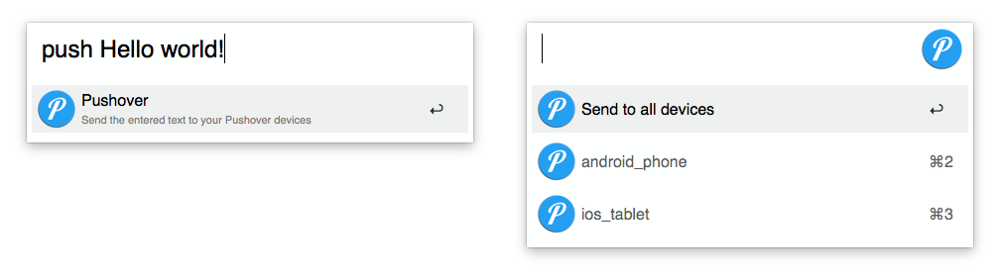

# Alfred Pushover

This workflow for [Alfred](https://www.alfredapp.com/) allows you to send notifications to your mobile devices with [Pushover](https://pushover.net/).

The workflow has two keywords `push <text to push>` and `pushc` to push your current clipboard. You can than push it to all your devices or select a specific one (see step 4. under Installation).

- If you push a URL the workflow will use the Pushover feature for pushing URLs, so it can be directly be opened in the App.
- If the URL points to an image it will send the image also.
- If you have the path to a local image in your clipboard it will send the image as well.

## Installation

1. Head over to Pushover and [create a new application](https://pushover.net/apps/build). Set a name and choose `Script` in the Type-dropdown. Copy the API Token of the newly created application.
2. [Download the Workflow here](https://github.com/stroebjo/alfred-pushover/releases/latest) and open it.
3. Head over to the settings pane of the Pushover workflow and configure the variables with your `USER_KEY` and the `APP_TOKEN` of the App you just created.
4. Optionally you can enter the names of your devices, so you can push notification to a specific device. For that set the `DEVICES` key in the workflow variables with a list of comma separated device names.

For the image preview to work you need to install the [requests](https://docs.python-requests.org/en/master/user/install/#install) package. Be sure to install it with the macOS system python: `$ /usr/bin/python3 -m pip install requests`.
